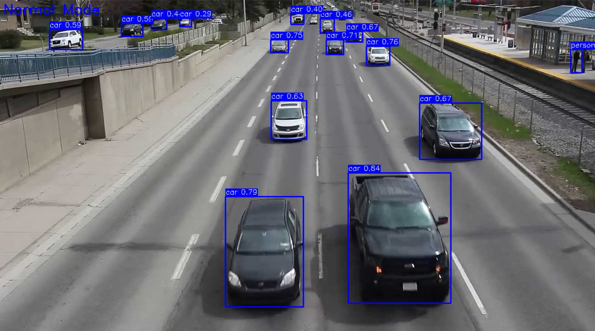

# YOLOv8 Object Detection with Night Vision



A Python application that performs real-time object detection using YOLOv8 with a toggleable night vision mode. The project combines Ultralytics YOLOv8 for object detection with OpenCV for video processing and night vision effects.

## Features

- Real-time object detection using YOLOv8 (nano model)
- Toggleable night vision mode with visual effects
- Bounding boxes with class labels and confidence scores
- Different color schemes for day/night modes
- Works with video files (easily extendable to webcam input)

## Requirements

- Python 3.7+
- OpenCV (cv2)
- Ultralytics YOLOv8
- NumPy

## Installation

1. Clone this repository:
   ```bash
   git clone https://github.com/yourusername/yolov8-night-vision.git
   cd yolov8-night-vision
